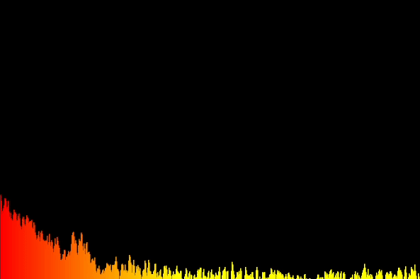

<p align="center"></p>
<h1 align="center">DiscoWave</h1>
DiscoWave is making discos just a little bit cooler! With awesome audio visualizations and song suggestions from guests, your next party is going to be even cooler!

## Description

DiscoWave is a website that a DJ can use with Spotify. Once a DJ has logged into Spotify, the Spotify API will find the song that is currently playing and will be displayed using an audio visualizer. This audio visualizer can be toggled between two types, allowing the DJ to choose the best one. A QR code will be on the screen, and other people can scan it to suggest songs they want to be played.

<p align="center"></p>

## Technologies Used

- Frontend Framework: React/NextJS
- Frontend Styling: Tailwind CSS
- Icons: React Icons (combination of Font Awesome, Heroicons, Ant Design Icons, and Ionicons5)
- Authentication: Next Auth
- OAuth type: Spotify/GitHub OAuth
- Visualizer: p5.js
- Languages: Typescript
- Database: Deta.sh

## Contributing

Prerequisites

- NodeJS installed as well as the Node Package Manager (`npm`)
- `yarn` is installed globally (install by running `npm i -g yarn`)
- Spotify OAuth App initialized
- Deta account already set up with project key (https://docs.deta.sh/docs/base/about#how-do-i-start)

Pull requests are welcome. For major changes, please open an issue first to discuss what you would like to change.

First, clone this repo on to your local machine

Then run `yarn install` in the project directory. You now have all the packages for the project installed!

You will need to add some environment variables to get started as well.

These are the environment variables you will need. `SPOTIFY_ID` is your Spotify OAuth app's client ID. `SPOTIFY_SECRET` is your Spotify OAuth app's client secret. `GITHUB_ID` and `GITHUB_SECRET` are the Github Client ID and Client Secret of your OAuth app, respectively. `NEXTAUTH_URL` is not too important (change this if you are running on a different URL/port). The Deta key is the Deta project key.

```
SPOTIFY_ID=
SPOTIFY_SECRET=
GITHUB_ID=
GITHUB_SECRET=
NEXTAUTH_URL=http://localhost:3000/
DETA_KEY=
```

## Thanks!

Thank you so much for checking out DiscoWave. It would mean the world if you left a star on our GitHub repo!
